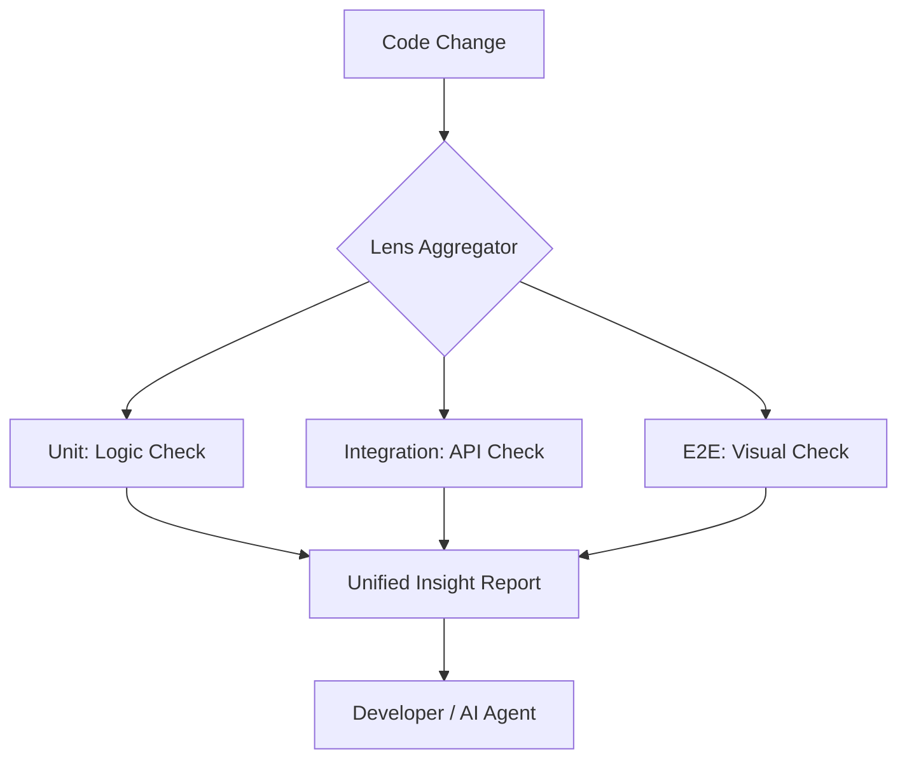
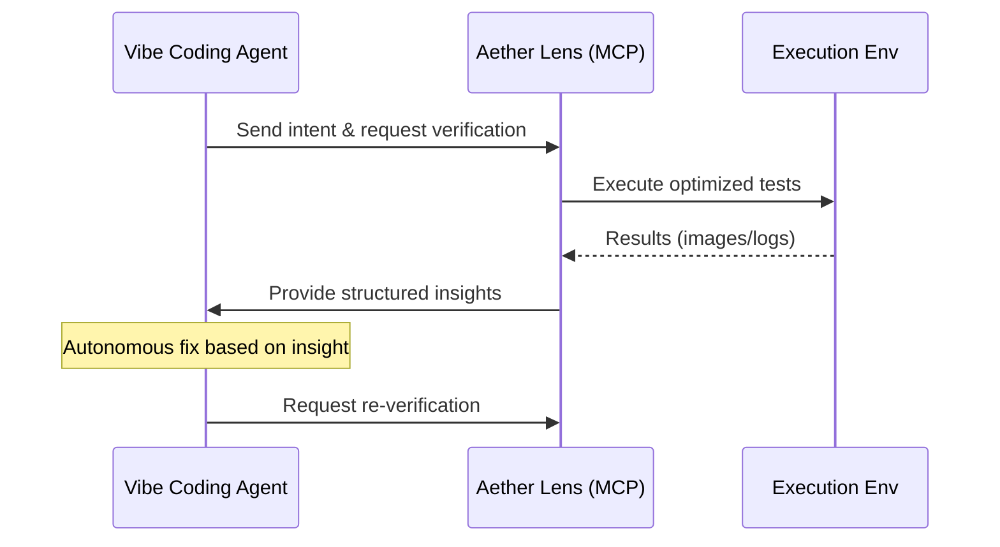

# Vibe Test Insight (VTI)

Vibecoding is a development style where developers focus on logic and creativity while minimizing tedious "verification work" and "environment setup" through collaboration with AI. Aether Lens embodies this style through the concept of **Vibe Test Insight (VTI)**.

> [!TIP]
> **What is VTI (Vibe Test Insight)?**
> It is an approach where tests are not just "pass/fail determinations," but AI evaluates whether the code's "intent (Vibe)" is correctly reflected and gives back insights to the developer.

## Prerequisites

To utilize the full capabilities of Aether Lens, a connection to one of the following LLMs is required:

- **OpenAI**: GPT-4o (Recommended)
- **Anthropic**: Claude 3.5 Sonnet
- **Google**: Gemini 1.5 Pro
- **Azure OpenAI**: (Configurable via `aether-lens.config.json`)

## Integration with Aether Platform

Aether Lens is deeply integrated into the Aether Platform ecosystem. With the execution infrastructure and AI context provided by the platform, advanced analysis is possible without complex configuration.

### Analysis Flexibility (Optional)

By default, analysis is performed based on the optimal judgment of the Aether Platform, but you can also explicitly specify an analysis strategy if necessary.

| Strategy | Description | Use Case |
| :--- | :--- | :--- |
| **Auto** | Automatic | Automatically identifies Frontend/Backend from file extensions. |
| **Frontend** | UI Focused | Forces Visual Regression and multi-device validation. |
| **Backend** | Logic Focused | Prioritizes API expectations and data integrity analysis. |
| **Microservice** | Cross-Scope | Analyzes workspace-wide and inter-service consistency. |
| **Custom** | Custom Defined | Specialized analysis via `custom_instruction`. |

### 🧠 Advanced: Custom Instructions

By using the `custom_instruction` field in `aether-lens.config.json`, you can enhance the AI analysis logic with project-specific context.

```json
{
  "strategy": "custom",
  "custom_instruction": "This project prioritizes accessibility. Check strictly for missing ARIA attributes or color contrast issues and provide improvement suggestions."
}
```

## Capabilities (Verification Types)

Specific examples of tests proposed and executed by Aether Lens.

### 👁️ Visual Regression (VRT)
Validates actual rendering results on a headless browser using Playwright.

- **Multi-Viewport**: Detects rendering issues on Desktop (1280px), Tablet (768px), and Mobile (375px).
- **Component Isolation**: Automatically identifies pages containing changed components and captures them specifically.
- **Snapshots**: Compares with the previous healthy state (baseline) and reports pixel-level differences.

### 🛠️ Command Verification
Ensures logical correctness by running scripts or tools within the project.

- **Build Check**: Executes `npm run build`, etc., to verify deployability.
- **Test Runner**: Extracts and runs only relevant tests from existing suites like Jest, Vitest, or Pytest (Smart Selection).
- **Linter / Formatter**: Provides instant feedback on style violations before pushing to CI.

### Browser Execution Strategies

Choose where to execute verifications based on project size and environment.

| Mode | Ease of Use | Isolation | Parallelism | Local Load | Use Case |
| :--- | :---: | :---: | :---: | :---: | :--- |
| **Kubernetes** | ✅ (Native) | ✅ | ✅ | 🟢 None | **Aether Platform (Default)** |
| **Docker** | ⚠️ | ✅ | ⚠️ | 🚨 High | Stability focused / CI Reproduction |
| **Local** | ✅ | ❌ | ❌ | 🚨 High | Personal Dec / Prototype |

### 🧩 Aggregation Layer (Multi-Layer Test)

Aether Lens functions as an **Aggregation Layer** that bundles tests from different layers. Rather than just a test runner, it acts as a conductor for various tools (Jest, Playwright, Backend Check).



- **Layered Execution**: Executes Unit (Logic), Integration (API), and E2E (Visual) tests in parallel or in dependency order.
- **Unified Insight**: Correlates "UI breakage" and "backend type errors" to identify the **Root Cause**.

> [!TIP]
> **Aether Platform Native**
> Aether Lens was built for the Aether Platform.
> By default, Headless Browsers are deployed on Kubernetes, and parallel tests are executed without additional configuration.
> Of course, it can also be easily used in Local or Docker environments and integrated smoothly into CI/CD pipelines.

## AI Collaboration

### AI Analysis Agent (Vibe Reader)
Analyzes `git diff` in real-time and automatically derives test scenarios and verification points based on the changes.

- **Diff Understanding**: Advanced LLM infers which features are affected.
- **Verification Set Recommendation**: Provides insights like "Given this change, you should check for header misalignment in mobile view."

import { TabItem, Tabs } from '@astrojs/starlight/components';

### A2A (Agent-to-Agent) Collaboration
Aether Lens achieves advanced collaboration with other AI agents (A2A) via the **Model Context Protocol (MCP)**.

- **Structured Insight**: Provides analysis results as structured data.
- **Autonomous DevLoop**: Enables agents to autonomously cycle through fixes and verifications.



#### MCP Setup Guide

<Tabs>
  <TabItem label="Antigravity">
    **Native Support**
    
    Antigravity (Aether Platform Agent) recognizes Aether Lens features as native tools.
    No additional installation setup is required. Ensure the `aether-lens` command is in your path.
  </TabItem>
  <TabItem label="Claude">
    **Claude Desktop Config**
    
    Add the following to your `claude_desktop_config.json`.
    Using `uvx` allows you to run the latest Aether Lens without polluting your Python environment.

    ```json
    {
      "mcpServers": {
        "aether-lens": {
          "command": "uvx",
          "args": ["aether-lens", "mcp"],
          "env": { "PYTHONUNBUFFERED": "1" }
        }
      }
    }
    ```
  </TabItem>
  <TabItem label="Cursor">
    **Cursor MCP Settings**
    
    Select "Add new MCP server" from `Cursor Settings` > `Features` > `MCP`.

    - **Command**: `uvx aether-lens mcp`
  </TabItem>
  <TabItem label="VSCode">
    **VSCode Marketplace**
    
    1. Install the **[MCP for VSCode](https://marketplace.visualstudio.com/items?itemName=McpConfig.mcp-config)** extension from the Marketplace.
    2. Run `MCP: Add Server` from the Command Palette (`Ctrl+Shift+P`) and enter the following:

    - **Name**: `aether-lens`
    - **Command**: `uvx`
    - **Args**: `aether-lens mcp`
  </TabItem>
</Tabs>

## To Accelerate Your Vibe

### Running via CLI (Stand-alone)

1. Define your project with `aether-lens-cli init`.
2. Start development with `aether-lens-cli . --watch`.
3. Optimal "Insights" are delivered in real-time from AI as you write code.

### Running via MCP (Agent-Integrated)

Give short instructions to your AI agent (Cursor/Claude).

> "Initialize Aether Lens" (`init_lens`)
> "Start Lens test" (`run_lens_test` or `start_lens_loop`)
> "Get vibe insight" (`get_vibe_insight`)

That's it! The agent will understand the context and automatically call the necessary tools.
