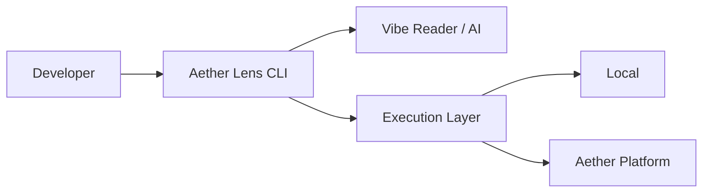

# Architecture Overview

Aether Lens is designed as a bridge between the developer's local environment (CLI) and the powerful execution infrastructure of Aether Platform.

## Basic Structure

### 1. CLI Agent
Acts as the frontend of Aether Lens, responsible for file monitoring, presenting summaries to the user, and interacting with the AI.

### 2. Vibe Reader (AI)
Interprets the "intent" of the code from `git diff`, deriving the optimal set of tests to run and providing corrective insights.

### 3. Execution Layer (Unified Task Runner)
An abstraction layer that offloads the execution of tasks themselves to **Docker containers** or **Kubernetes Pods**.
The developer's local machine acts merely as a "control terminal," while heavy build processes and test executions are handled in isolated environments. This prevents local environment pollution and guarantees that the entire team verifies in an identical environment.

## Data Flow (Unified Aggregation)

Aether Lens centrally manages all execution results as "Insights," regardless of whether they are Frontend or Backend.

1. **Trigger**: Detects file changes or manual triggers.
2. **Dispatch**: Dispatches tasks to the optimal runner (Frontend VRT / Backend Test).
3. **Normalize**: Normalizes different output formats (JSON, JUnit XML, Console) into **Allure-compatible formats**.
4. **Insight**: Provides unified reports to developers and AI agents. capable of exporting to Allure Reporter for team-wide dashboards.
