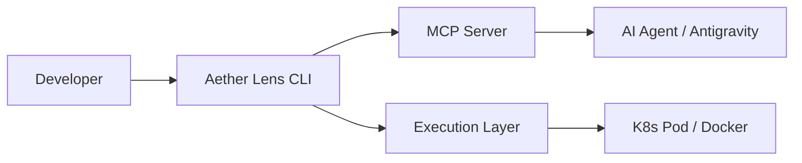

# Architecture Overview

Aether Lens is designed as a bridge between the developer's local environment (CLI) and the powerful execution infrastructure of Aether Platform.

## Basic Structure

### 1. CLI & MCP Server
In addition to its CLI functionality, Aether Lens operates as an **MCP (Model Context Protocol) server**. This allows AI agents to directly reference current test statuses and "vibes".

### 2. Vibe Reader (AI)
Interprets the "intent" of the code from `git diff`, deriving the optimal set of tests to run and providing corrective insights.

### 3. Execution Layer (Unified Task Runner)
Ather Lens dispatches tasks to **Docker containers** or **Kubernetes Pods** via an abstraction layer.
The developer's local machine acts as a control terminal, while heavy build processes and test executions are offloaded to isolated environments. This prevents local environment pollution and ensures consistency across the team.

---

## 🧠 Edge AI & NPU Acceleration (2026 Standard)

Aether Lens is optimized for the hardware evolution of 2026, specifically achieving a **Cost Efficient Dev Loop** via **NPUs (Neural Processing Units)**.

- **Local Inference**: Before sending large datasets (logs, source code, screenshots) to cloud LLMs, lightweight edge models on the local NPU perform primary analysis (distillation) to strip away redundant data.
- **Token Efficiency**: By sending only refined "Insights," it reduces token expenses by up to 1/100.
- **Eco-System**: Minimizing data transfer reduces network load and enables rapid feedback with near-offline speed.
- **Hardware Agnostic**: Systems without NPUs automatically fallback to CPU/GPU processing or cloud-side aggregation proxying.

## Data Flow (Unified Aggregation)

Aether Lens centrally manages all execution results as "Insights," regardless of whether they are Frontend or Backend. A key feature is "Shadow Verification," which operates autonomously in the background without interrupting the developer, and "Layered Context Provisioning" that prevents AI context waste.

### Layered Context (via MCP)
Information is provided in two layers to allow AI agents to operate efficiently.

1. **Layer 1: Semantic Summary (High-Level)**
   - Pass/Fail status, confidence scores, and AI summaries.
   - Always included in the agent's context, minimizing token consumption.
2. **Layer 2: Raw Evidence (On-Demand)**
   - Complete execution logs (raw data), detailed screenshots, and trace info.
   - Exposed as MCP **Resources**. Only "referenced" when the agent deems it necessary (e.g., on verification failure), preventing unnecessary token consumption.

1. **Autonomous Watch**: The CLI detects file changes in milliseconds, and AI determines the verification requirements.
2. **Background Execution**: While the developer is coding, tasks are executed in the background on Docker/K8s.
3. **MCP Sync (Normalize)**: Normalizes outputs from various tools into Allure-compatible formats and aggregates them to the MCP server.
4. **Instant Insight**: When verification succeeds or issues are found, the AI agent provides insights without interruption.
