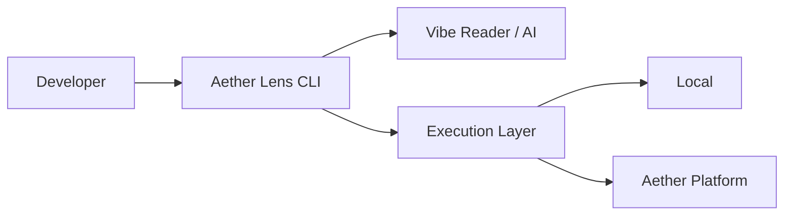

# Architecture Overview

Aether Lens is designed as a bridge between the developer's local environment (CLI) and the powerful execution infrastructure of Aether Platform.

## Basic Structure

### 1. CLI Agent
Acts as the frontend of Aether Lens, responsible for file monitoring, presenting summaries to the user, and interacting with the AI.

### 2. Vibe Reader (AI)
Interprets the "intent" of the code from `git diff`, deriving the optimal set of tests to run and providing corrective insights.

### 3. Execution Layer
An abstraction layer that allows tests to be executed transparently on the local machine, in Docker, or on the Aether Platform's Kubernetes infrastructure.

## Data Flow

1. **Watch**: Detects file changes.
2. **Analyze**: AI analyzes the impact of the changes.
3. **Execute**: Extracts and runs only the necessary verifications.
4. **Insight**: Returns execution results to the developer as "Insights".
