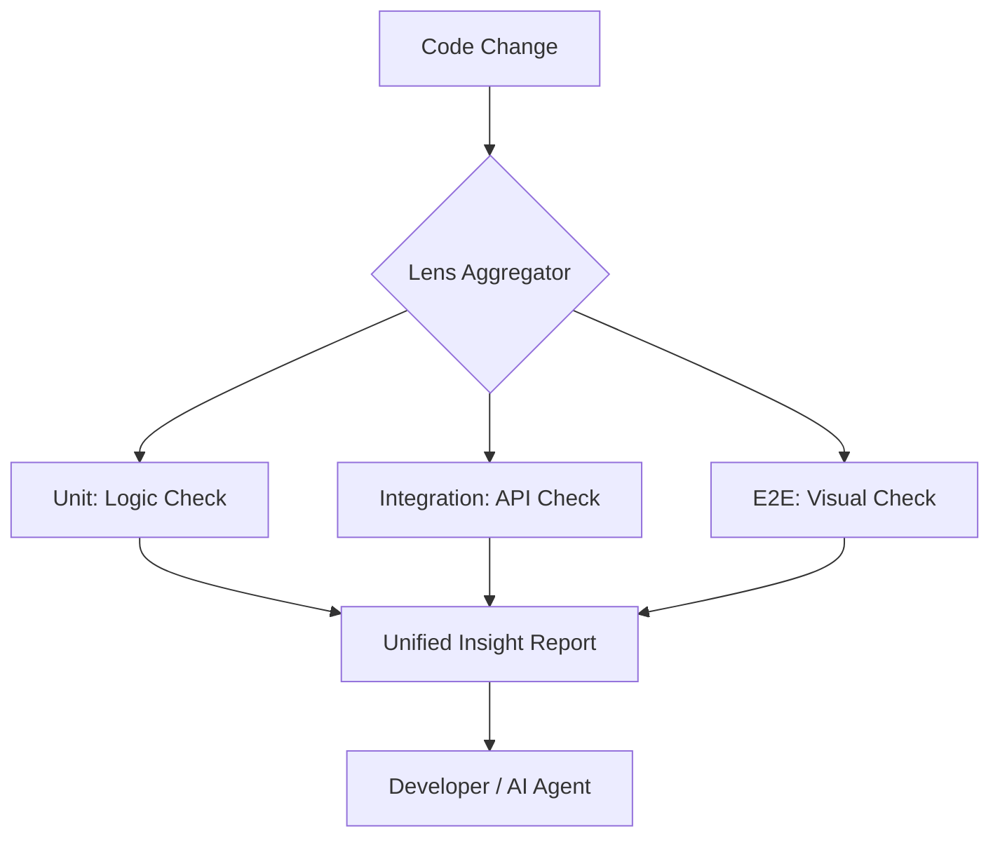
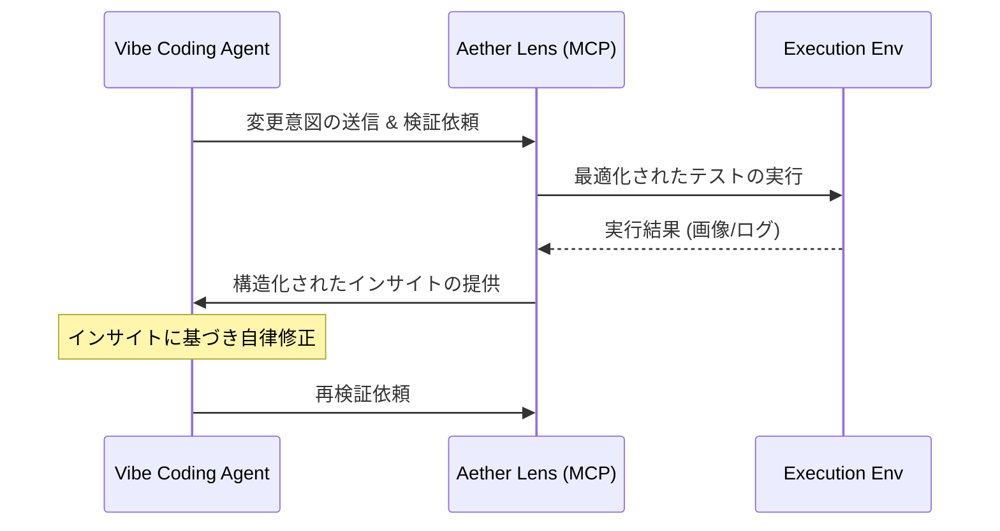

# Vibe Test Insight (VTI)

Vibecoding とは、開発者がロジックや創造性に集中し、退屈な「確認作業」や「環境構築」を AI と協調して最小化する開発スタイルです。Aether Lens は、このスタイルを **Vibe Test Insight (VTI)** というコンセプトで具現化します。

> [!TIP]
> **VTI (Vibe Test Insight) とは？**
> テストを単なる「合否判定」ではなく、コードの「意図（Vibe）」が正しく反映されているかを AI が評価し、開発者にインサイト（洞察）として還元するアプローチです。

## 動作要件 (Prerequisites)

Aether Lens の全機能を利用するには、以下のいずれかの LLM との接続が必要です。

- **OpenAI**: GPT-4o (Recommended)
- **Anthropic**: Claude 3.5 Sonnet
- **Google**: Gemini 1.5 Pro
- **Azure OpenAI**: (Configurable via `aether-lens.config.json`)

### 🚀 Execution Modes (Task Offloading)

Aether Lens は、テストの実行場所を柔軟に切り替えることができます。タスクそのものをコンテナ環境へオフロードすることで、ローカルマシンの負荷を最小限に抑えます。

- **Local**: 高速な単体テストや軽いスクリプトの実行に。
- **Docker**: 本番に近い環境で、依存関係を含めた完全なテストを実行。
- **Kubernetes**: Aether Platform のクラスタパワーを使い、大規模な並列テストを実行。

## Aether Platform との統合

Aether Lens は Aether Platform のエコシステムに深く統合されています。プラットフォームが提供する実行基盤と AI コンテキストにより、複雑な設定なしで高度な解析が可能です。

### 解析の柔軟性（オプション）

標準では Aether Platform の最適な判断に基づき解析が行われますが、必要に応じて解析戦略（Strategy）を明示的に指定することも可能です。

| 戦略 | 内容 | 用途 |
| :--- | :--- | :--- |
| **Auto** | 自動判別 | ファイル拡張子から Frontend/Backend を自動判別。 |
| **Frontend** | UI 重視 | ビジュアル回帰、マルチデバイス検証を強制実行。 |
| **Backend** | ロジック重視 | API 期待値、データ整合性解析を重点化。 |
| **Microservice** | スコープ横断 | ワークスペース全体やサービス間整合性を解析。 |
| **Custom** | 独自定義 | `custom_instruction` による特化解析。 |

### 🧠 Advanced: Custom Instructions

`aether-lens.config.json` の `custom_instruction` フィールドを使用することで、AI の解析ロジックをプロジェクト固有のコンテキストで強化できます。

```json
{
  "strategy": "custom",
  "custom_instruction": "このプロジェクトはアクセシビリティを最優先しています。ARIA 属性の欠如や色のコントラスト比について特に厳しくチェックし、改善案を提示してください。"
}
```

## 検証タイプ詳細 (Capabilities)

Aether Lens が提案・実行するテストの具体例です。

### 👁️ Visual Regression (VRT)
Playwright を使用して、ヘッドレスブラウザ上で実際の描画結果を検証します。

- **Multi-Viewport**: Desktop (1280px), Tablet (768px), Mobile (375px) での表示崩れを検知。
- **Component Isolation**: 変更されたコンポーネントを含むページを自動特定し、ピンポイントで撮影。
- **Snapshots**: 前回の正常な状態（ベースライン）と比較し、ピクセル単位の差分を報告。

### 🛠️ Command Verification
プロジェクト内のスクリプトやツールを実行し、論理的な正しさを保証します。

- **Build Check**: `npm run build` 等を実行し、デプロイ可能性を確認。
- **Test Runner**: Jest, Vitest, Pytest 等の既存テストスイートから、関連するものだけを抽出して実行 (Smart Selection)。
- **Linter / Formatter**: CI にプッシュする前に、スタイル違反を即座にフィードバック。

### ブラウザ実行モード (Browser Strategy)

プロジェクトの規模や環境に合わせて、検証の実行場所を選択できます。

| モード | 手軽さ | 環境分離 | 並列性 | ローカル負荷 | ユースケース |
| :--- | :---: | :---: | :---: | :---: | :--- |
| **Kubernetes** | ✅ (Native) | ✅ | ✅ | 🟢 無 | **Aether Platform (標準)** |
| **Docker** | ⚠️ | ✅ | ⚠️ | 🚨 高 | 安定性重視 / CI 再現 |
| **Local** | ✅ | ❌ | ❌ | 🚨 高 | 個人開発 / プロトタイプ |

### 🧩 Aggregation Layer (Multi-Layer Test)

Aether Lens は、あらゆる種類のテスト・タスク実行結果を束ねる **Unified Aggregation Layer** として機能します。

フロントエンドの VRT 結果も、バックエンドの単体テスト結果も、全て等価な「イベント」として処理されます。これにより、特定の言語やフレームワークに依存せず、プロジェクト全体の品質ステータスを一元的に可視化します。



- **Layered Execution**: Unit (Logic), Integration (API), E2E (Visual) を並列または依存関係順に実行。
- **Unified Insight**: 「UI の崩れ」と「バックエンドの型エラー」を突き合わせ、根本原因（Root Cause）を特定します。

> [!TIP]
> **Aether Platform Native**
> Aether Lens はその名の通り、Aether Platform のために作られました。
> デフォルトで Kubernetes 上に Headless Browser がデプロイされ、追加設定なしで並列テストが実行されます。
> もちろん、ローカルや Docker 環境でも手軽に利用でき、CI/CD パイプラインへの組み込みもスムーズです。

## AI による協調

### AI 解析エージェント (Vibe Reader)
`git diff` をリアルタイムで解析し、変更内容に応じたテストシナリオや検証ポイントを自動で導き出します。

- **差分理解**: どの機能が影響を受けるかを高度な LLM が推論。
- **検証セット推奨**: 「この変更ならモバイルビューのヘッダー崩れを確認すべきです」といったインサイトの提供。

import { TabItem, Tabs } from '@astrojs/starlight/components';

### A2A (Agent-to-Agent) 連携
Aether Lens は **Model Context Protocol (MCP)** を通じて、他の AI エージェントとの高度な連携（A2A）を実現します。

- **Structured Insight**: 解析結果を構造化データとして提供。
- **Autonomous DevLoop**: エージェント同士が自律的に修正・検証サイクルを回します。



#### MCP 導入ガイド

<Tabs>
  <TabItem label="Antigravity">
    **Native Support**
    
    Antigravity (Aether Platform Agent) は、Aether Lens の機能をネイティブツールとして認識します。
    特に追加のインストール設定は不要です。`aether-lens` コマンドがパスに通っていることを確認してください。
  </TabItem>
  <TabItem label="Claude">
    **Claude Desktop Config**
    
    `claude_desktop_config.json` に以下を追加してください。
    `uvx` を使用することで、Python 環境を汚さずに最新の Aether Lens を実行できます。

    ```json
    {
      "mcpServers": {
        "aether-lens": {
          "command": "uvx",
          "args": ["aether-lens", "mcp"],
          "env": { "PYTHONUNBUFFERED": "1" }
        }
      }
    }
    ```
  </TabItem>
  <TabItem label="Cursor">
    **Cursor MCP Settings**
    
    `Cursor Settings` > `Features` > `MCP` から "Add new MCP server" を選択します。

    - **Command**: `uvx aether-lens mcp`
  </TabItem>
  <TabItem label="VSCode">
    **VSCode Marketplace**
    
    1. Marketplace から **[MCP for VSCode](https://marketplace.visualstudio.com/items?itemName=McpConfig.mcp-config)** 拡張機能をインストールします。
    2. コマンドパレット (`Ctrl+Shift+P`) から `MCP: Add Server` を実行し、以下を入力します。

    - **Name**: `aether-lens`
    - **Command**: `uvx`
    - **Args**: `aether-lens mcp`
  </TabItem>
</Tabs>

## バイブスを加速させるために

### CLI で実行する場合 (Stand-alone)

1. `aether-lens-cli init` でプロジェクトを定義。
2. `aether-lens-cli . --watch` で開発を開始。
3. コードを書くたびに、最適な「インサイト」が AI からリアルタイムで届けられます。

### MCP 経由で実行する場合 (Agent-Integrated)

導入済みの AI エージェント（Cursor/Claude）に対して、短い言葉で指示を出してください。

> 「Aether Lens を初期化して」 (`init_lens`)
> 「Lens を起動して」 (`run_lens_test` または `start_lens_loop`)
> 「今のバイブス（インサイト）を教えて」 (`get_vibe_insight`)

これだけで、エージェントが状況を理解し、必要なツールを自動的に呼び出します。
