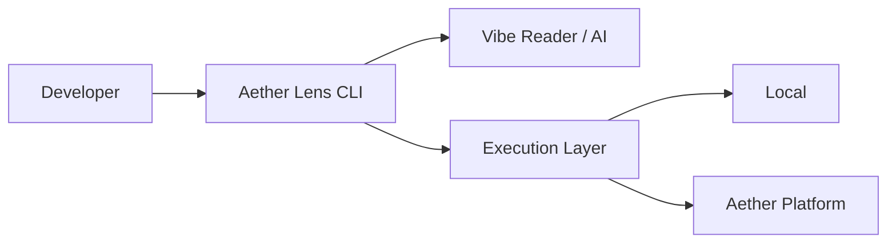

# アーキテクチャ概要

Aether Lens は、開発者のローカル環境（CLI）と Aether Platform の強力な実行基盤を繋ぐブリッジとして設計されています。

## 基本構造

### 1. CLI エージェント
Aether Lens のフロントエンドとして、ファイルの監視、ユーザーへのサマリ提示、および AI との対話を担当します。

### 2. Vibe Reader (AI)
`git diff` からコードの「意図」を読み取り、実行すべき最適なテストセットや修正インサイトを導き出します。

### 3. Execution Layer (Unified Task Runner)
抽象化されたレイヤーにより、タスクそのものを **Docker コンテナ** や **Kubernetes Pod** 上にオフロードして実行します。
開発者のローカルマシンは単なる「操作端末」となり、重いビルドプロセスやテスト実行はすべて隔離された環境で行われます。これにより、ローカル環境の汚染を防ぎ、チーム全員が同一の環境で検証できることを保証します。

## データフロー (Unified Aggregation)

Aether Lens は、Frontend/Backend を問わず、すべての実行結果を「インサイト」として一元管理します。

1. **Trigger**: ファイル変更、または手動トリガーを検知。
2. **Dispatch**: 最適なランナー（Frontend VRT / Backend Test）へタスクを振り分け。
3. **Normalize**: 各ツールの異なる出力形式（JSON, JUnit XML, Console）を **Allure 互換フォーマット** に正規化。
4. **Insight**: 統合されたレポートとして開発者および AI エージェントへ提供。また、チーム全体のダッシュボードとして Allure Reporter へ出力可能。
