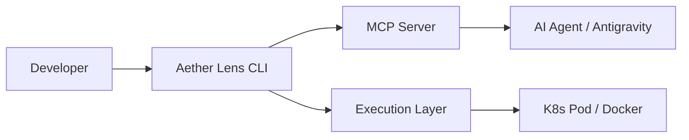

# アーキテクチャ概要

Aether Lens は、開発者のローカル環境（CLI）と Aether Platform の強力な実行基盤を繋ぐブリッジとして設計されています。

## 基本構造

### 1. CLI & MCP Server
Aether Lens は CLI としての機能に加え、**MCP (Model Context Protocol) サーバー** として動作します。これにより、AI エージェントが現在のテスト状況や「バイブス」を直接参照可能になります。

### 2. Vibe Reader (AI)
`git diff` からコードの「意図」を読み取り、実行すべき最適なテストセットや修正インサイトを導き出します。

### 3. Execution Layer (Unified Task Runner)
抽象化されたレイヤーにより、タスクそのものを **Docker コンテナ** や **Kubernetes Pod** 上にオフロードして実行します。
開発者のローカルマシンは単なる「操作端末」となり、重いビルドプロセスやテスト実行はすべて隔離された環境で行われます。これにより、ローカル環境の汚染を防ぎ、チーム全員が同一の環境で検証できることを保証します。

---

## 🧠 Edge AI & NPU Acceleration (2026 Standard)

Aether Lens は、2026年時点でのハードウェアの進化、特に **NPU (Neural Processing Unit)** の普及に最適化されています。

- **Local Inference**: 実行ログ、ソースコード、スクリーンショットなどの巨大なデータをクラウド LLM に送る前に、ローカル NPU 上の軽量エッジモデルが一次解析（蒸留）を行います。
- **Token Efficiency**: 解析結果の「インサイト（結論）」のみをクラウドへ送ることで、トークンコストを最大 1/100 まで削減します。
- **Privacy First**: 生データがローカルから出ないため、機密性の高いプロジェクトでも安心して AI の恩恵を受けられます。
- **Hardware Agnostic**: NPU がない環境では自動的に CPU/GPU 処理にフォールバック、あるいはクラウド側での集約代行へと切り替わります。

- **Build Stabilization**: `architecture.mdx` のフロントエンド修正時に欠落した frontmatter を復元し、ドキュメントのビルドエラーを解消。
- **Brand Story Alignment**: ランディングページ（Hero, FeaturesGrid）を更新し、**「シャドウ検証（裏側での自動実行）」**や**「MCP 経由の AI 協調」**、**「階層化されたコンテキストによるトークン節約」**といった最新の強みをフロントに配置。
- **UI Polish**: サイドバーのハイライト処理やヘッダーのグラデーション適用により、ドキュメント全体の閲覧体験を向上。

## データフロー (Unified Aggregation)

Aether Lens は、Frontend/Backend を問わず、すべての実行結果を「インサイト」として一元管理します。特に、開発者の手を止めずに裏側で自律的に動作する「シャドウ検証」と、AI のコンテキストを浪費しない「階層化されたコンテキスト提供」が特徴です。

### 階層化されたコンテキスト (Layered Context via MCP)
AI エージェントが効率的に動作できるよう、情報を 2 つのレイヤーで提供します。

1. **Layer 1: Semantic Summary (High-Level)**
   - 実行結果の成否（PASS/FAIL）、信頼性スコア、AI による要約。
   - 常にエージェントのコンテキストに含まれ、トークン消費を最小限に抑えます。
2. **Layer 2: Raw Evidence (On-Demand)**
   - 全実行ログ（生データ）、詳細なスクリーンショット、トレース情報。
   - MCP の **Resources** として露出。エージェントが必要（検証失敗時など）と判断した際にのみ「参照」され、無駄なトークン消費を防ぎます。

1. **Autonomous Watch**: CLI がファイルの変更をミリ秒単位で検知し、AI が検証の要件を判断。
2. **Background Execution**: 開発者がコードを書いている間に、Docker/K8s 上でタスクがバックグラウンド実行される。
3. **MCP Sync (Normalize)**: 各ツールの出力を Allure 互換形式で MCP サーバーへ正規化・集約。
4. **Instant Insight**: 検証に成功、または問題が発見されると、AI エージェントが割り込みなしでインサイトを提供。
