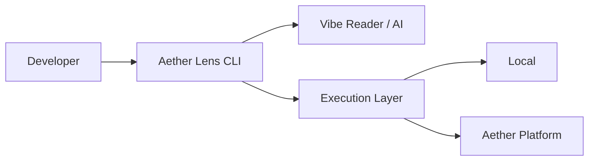

# アーキテクチャ概要

Aether Lens は、開発者のローカル環境（CLI）と Aether Platform の強力な実行基盤を繋ぐブリッジとして設計されています。

## 基本構造

### 1. CLI エージェント
Aether Lens のフロントエンドとして、ファイルの監視、ユーザーへのサマリ提示、および AI との対話を担当します。

### 2. Vibe Reader (AI)
`git diff` からコードの「意図」を読み取り、実行すべき最適なテストセットや修正インサイトを導き出します。

### 3. Execution Layer
抽象化されたレイヤーにより、ローカルマシン、Docker、または Kubernetes 上の Aether Platform 基盤で透過的にテストを実行します。

## データフロー

1. **Watch**: ファイル変更を検知。
2. **Analyze**: AI が変更のインパクトを解析。
3. **Execute**: 必要な検証のみを抽出して実行。
4. **Insight**: 実行結果を開発者に「インサイト」として還元。
